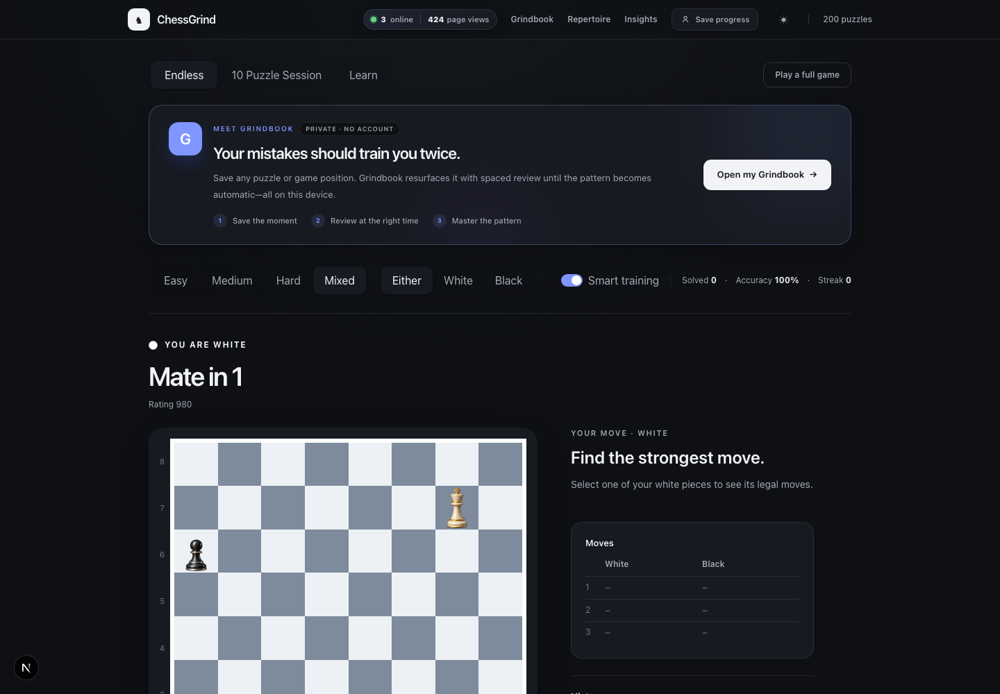
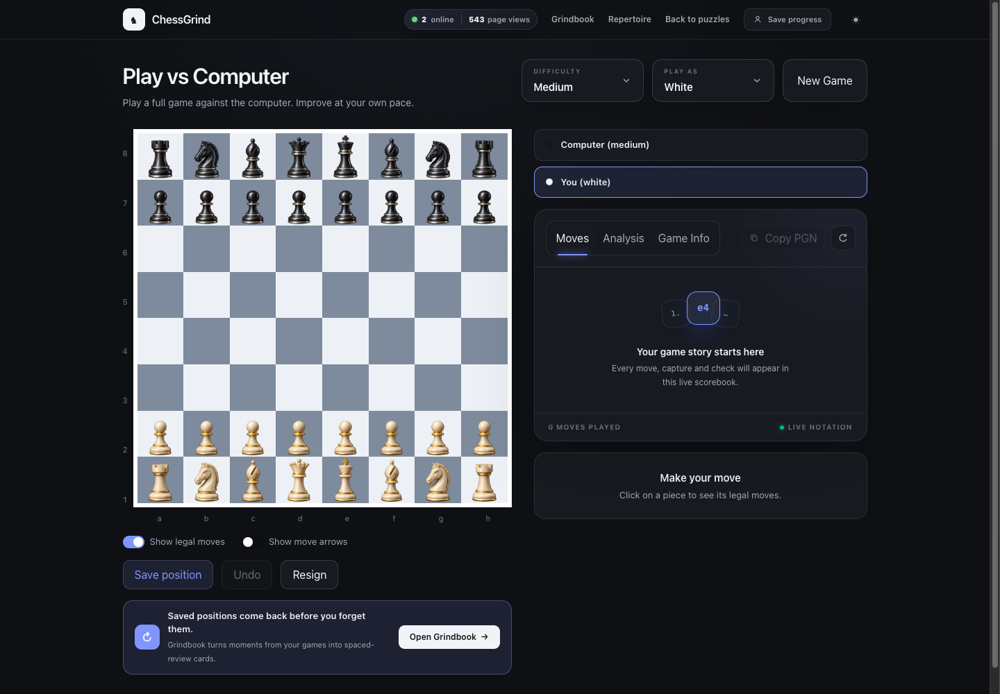
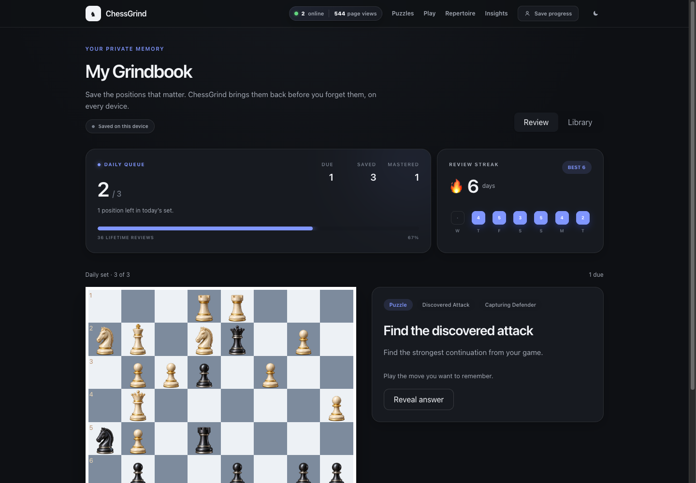
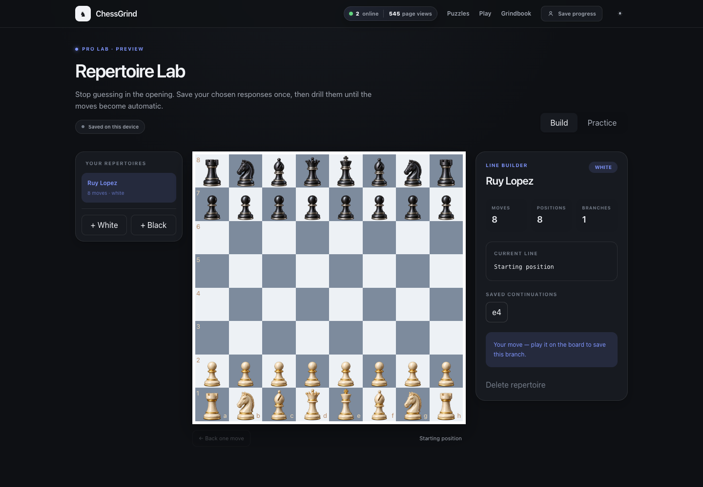
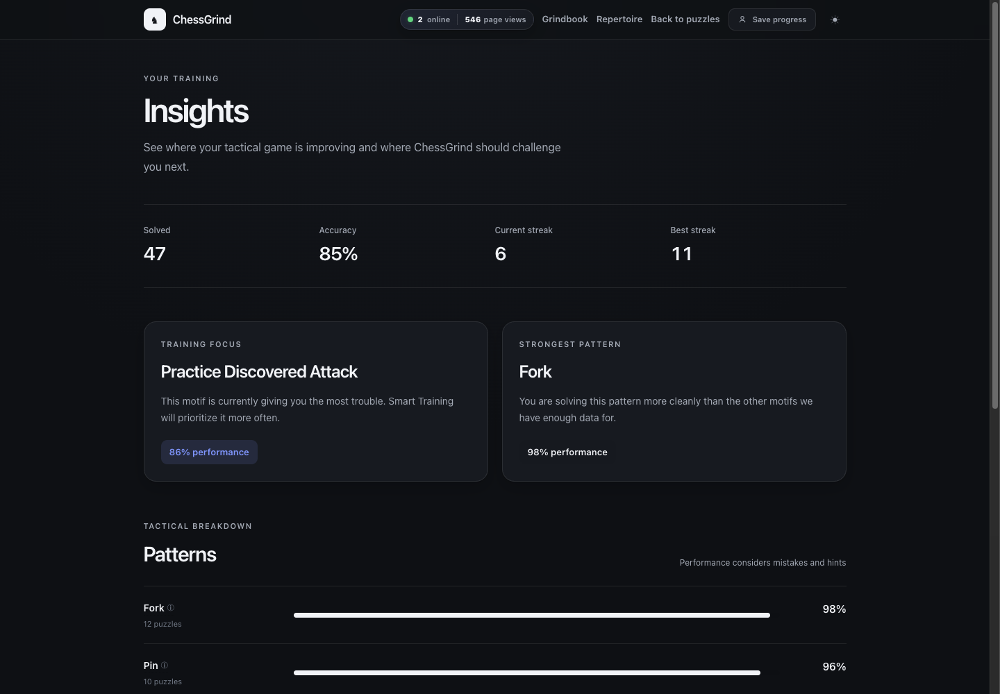
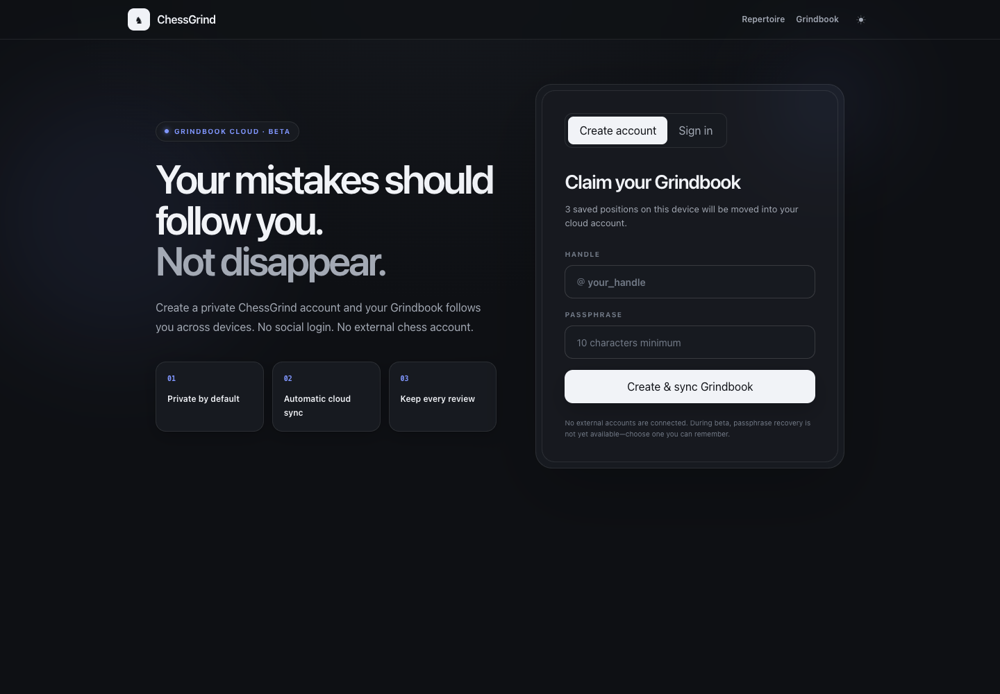

# ChessGrind

**ChessGrind remembers your mistakes until you stop making them.**

A private, adaptive chess training platform that connects puzzles, AI games, spaced repetition, opening preparation, and personal performance insights into one training loop.

[**Try ChessGrind live →**](https://chess-grind-seven.vercel.app)



## Why ChessGrind?

Most chess sites give everyone the same content. ChessGrind turns the positions *you* struggle with into future training:

```text
Solve puzzles or play the computer
                 ↓
ChessGrind detects and saves important mistakes
                 ↓
Grindbook schedules those positions for review
                 ↓
You recall the move until the pattern becomes automatic
```

No external chess-service connection is required. Guests can train locally, while an optional first-party ChessGrind account adds private cross-device sync.

## Features

### Adaptive puzzle training

- 200 ChessGrind Original positions with ratings and tactical themes
- Endless, guided **Learn**, and focused **10 Puzzle Session** modes
- Easy, medium, hard, and mixed difficulty filters
- Train as White, Black, or either side
- Smart Training weights future puzzles toward weaker tactical patterns
- Click or drag pieces with blue legal-move and capture indicators
- Progressive hints, tactical-theme explanations, and post-solve explanations
- Accuracy, clean-solve streaks, move history, sound feedback, and premium pieces
- Lightweight confetti after every solve and a full celebration after a completed session
- Wrong puzzle moves are automatically captured in Grindbook

### Play vs Computer

- Full legal games against three computer difficulty levels
- Choose White or Black; the computer can make the opening move
- Position-aware computer search with repetition-loop prevention
- Optional legal-move dots and move arrows
- Premium move ledger with SAN notation, latest-move highlighting, and automatic scrolling
- Moves, Analysis, and Game Info views
- Copy PGN, undo, resign, reset, and save any position
- Meaningful blunders are detected automatically and converted into Grindbook drills



### My Grindbook

Grindbook is a private memory system for chess positions—not a generic bookmarks folder.

- Save positions from puzzles, AI games, analysis, and openings
- Automatic capture of wrong puzzle moves and serious in-game mistakes
- Duplicate-position prevention using normalized positions and solution moves
- Interactive board review with **Again**, **Hard**, and **Got it** ratings
- Spaced-repetition scheduling with Learning, Familiar, and Mastered states
- Prioritized daily queue with a five-position target
- Current streak, best streak, seven-day activity, and lifetime review totals
- Personal library with source, tags, mastery, and next-review date
- Premium completion celebration when every due card is reviewed
- Local-first guest storage and optional account sync



### Repertoire Lab

- Create separate White and Black opening repertoires
- Build lines by playing directly on the board
- Add multiple opponent responses from the same position
- Normalized position matching merges transpositions
- Step backward through a line or jump through saved continuations
- Practice mode plays the opponent side and quizzes only your chosen moves
- Moves outside the saved repertoire are rejected immediately
- Rename, delete, and sync repertoires across devices
- “Line conquered” celebration after recalling a complete variation



### Training Insights

- Total puzzles solved, accuracy, current streak, and best streak
- Per-theme performance based on mistakes and hints—not just completions
- Strongest tactical pattern and recommended training focus
- Tactical breakdown with observed sample sizes and performance bars
- Smart Training uses the same profile to adapt future puzzle selection



### Private ChessGrind accounts

- Native handle and passphrase accounts—no social login
- Passwords protected with salted `scrypt` hashes
- Secure, HTTP-only session cookies
- Grindbook cards, review history, and repertoires sync through Upstash Redis
- Guest data is merged into the account on first sign-in
- The full training experience still works without creating an account



### Product polish

- Custom pearl/gold and obsidian chess pieces
- Responsive dark and light themes
- Custom premium menus instead of browser-native selects
- Total page views and current online presence
- Reduced-motion support for animated rewards
- Vercel Analytics and Speed Insights

## Technology

| Area | Implementation |
| --- | --- |
| Framework | Next.js 16 App Router, React 19, TypeScript |
| Styling | Tailwind CSS 4 and CSS custom properties |
| Chess rules | `chess.js` |
| Board UI | `react-chessboard` with custom pieces |
| Computer play | In-browser position evaluation and depth-based search |
| Persistence | Browser `localStorage` for guests; Upstash Redis for accounts |
| Authentication | First-party handle/passphrase, Node `scrypt`, secure cookies |
| Analytics | Vercel Analytics and Speed Insights |
| Hosting | Vercel |

## Application routes

| Route | Purpose |
| --- | --- |
| `/` | Cinematic product landing page |
| `/train` | Adaptive puzzle training |
| `/play` | Full games against the computer |
| `/grindbook` | Daily spaced review and saved-position library |
| `/repertoire` | Visual repertoire builder and memory drills |
| `/insights` | Tactical performance and training recommendations |
| `/account` | Create, access, and manage a private cloud account |

The server API provides authentication, Grindbook sync, repertoire sync, and visitor-presence endpoints under `/api`.

## Run locally

### Requirements

- Node.js 22 recommended
- npm

```bash
git clone https://github.com/shubhambhar007/ChessGrind.git
cd ChessGrind
npm install
npm run dev
```

Open [http://localhost:3000](http://localhost:3000).

The app uses an in-memory development fallback when Redis variables are absent. Puzzle training, AI games, Grindbook, Repertoire Lab, and local guest progress therefore work immediately.

### Available commands

```bash
npm run dev      # Start the development server
npm run build    # Create a production build
npm run start    # Run the production build
npm run lint     # Run ESLint
npm run puzzles:validate # Audit all puzzle positions and solution lines
npm run puzzles:generate # Rebuild the deterministic original library
```

## Enable cloud accounts and persistent visitor statistics

Create an Upstash Redis database—directly or through the Vercel Storage integration—and add these environment variables:

```bash
UPSTASH_REDIS_REST_URL=
UPSTASH_REDIS_REST_TOKEN=
```

ChessGrind also recognizes the variable names produced by the prefixed Vercel integration:

```bash
UPSTASH_REDIS_REST_KV_REST_API_URL=
UPSTASH_REDIS_REST_KV_REST_API_TOKEN=
```

Never commit Redis tokens or other credentials to the repository.

## Deployment

1. Import the repository into Vercel.
2. Attach an Upstash Redis store to the project.
3. Confirm the Redis environment variables are available to Production and Preview.
4. Deploy `main`.

Without Redis, production account and persistent visitor endpoints intentionally report storage as unavailable; the local-first training tools continue to work in the browser.

## Data and privacy model

- Guest Grindbook, repertoire, theme, and training progress live in that browser's local storage.
- Creating a ChessGrind account merges compatible local training data into the private cloud account.
- ChessGrind does not require an external chess-service account.
- Account passphrases are never stored directly.
- Signing out removes the synced account copy from the current browser.

## Project structure

```text
app/                    Pages, UI components, and API routes
data/puzzles.ts         Curated puzzle dataset
lib/chess-engine.ts     Computer move selection and move analysis
lib/grindbook.ts        Saved-position and spaced-repetition model
lib/grindbook-progress.ts
                        Review history and streak calculations
lib/repertoire.ts       Opening tree persistence and transpositions
lib/server/             Authentication and storage adapters
public/pieces/          Custom ChessGrind piece assets
docs/screenshots/       README product gallery
```

## Product direction

ChessGrind is being built around one idea:

> Play, discover what is holding you back, and drill it until it is fixed.

The current Repertoire Lab is marked as a Pro preview. Future monetization can place limits around saved positions, advanced mistake extraction, unlimited repertoires, and deeper weakness reporting while keeping the core training loop useful for free players.
